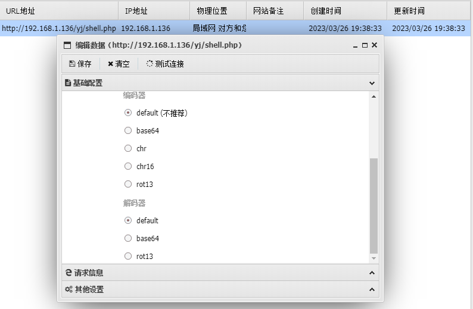

## 文前漫谈

在学习Godzaill流量的时候，我发现了批量解密流量包流量的新思路——py的mitmproxy模块，中间人攻击（Man-in-the-middle attack）的意思

mitmproxy模块就相当于py里的burp suite，更有用的是它支持我们自定义脚本处理http的请求和响应内容（在mitmproxy里叫addon脚本），这正好解决了我的大问题

> mitmproxy安装后有 3 个命令行工具：mitmproxy, mitmdump, mitmweb
>
> mitmproxy：`交互式；查看流量数据 (请求与响应)；执行自定义脚本`
>
> mitmdump：`执行自定义脚本，脚本在 Mitmproxy 中叫做 Addon`
>
> mitmweb：`mitmweb是一个基于Web的用户界面，用于与mitmproxy交互和监视HTTP / HTTPS流量。它使开发人员能够更轻松地查看和分析代理拦截的网络流量。`

用mitmproxy分析抓包很方便


2023-4-10更

> 不知道当时咋想的，直接用pyshark分包解不久行了吗，搞的挺麻烦


## 蚁剑流量解密

蚁剑自带的编码器，解码器都很简单，直接过一遍了

编码器就是对http请求的内容进行对应的编码，解码器就是对返回报文进行的编码

```shell
mitmproxy -p 9000
```

用mitmproxy模块启动一个http代理，方便后续我们观察http的请求和响应

依据蚁剑自带的编码和解码器，挨个试一下




### 编码器

> * default编码
>
> 直接明文传输


>* base64编码器
>
>直接按照shell里的解密顺序就行


>* chr 型
>
>代码复制下来，调试或者直接赋值输出


 


> chr(16) 型
>
> 同chr 型，只不过换成了hex的形式


>rot13型
>
>rot13再转一次就行


### 解码器


> base64 型
>
> base64解密


> rot13型
>
> rot13解密


## 完

这个只是流量解密系列的开端，就先写蚁剑的简单解密了，继续会更上蚁剑的bypasswaf和自定义编码器、解码器

其实冰蝎、哥斯拉流量默认解密我都搞得差不多了，后面整整也更上来

 