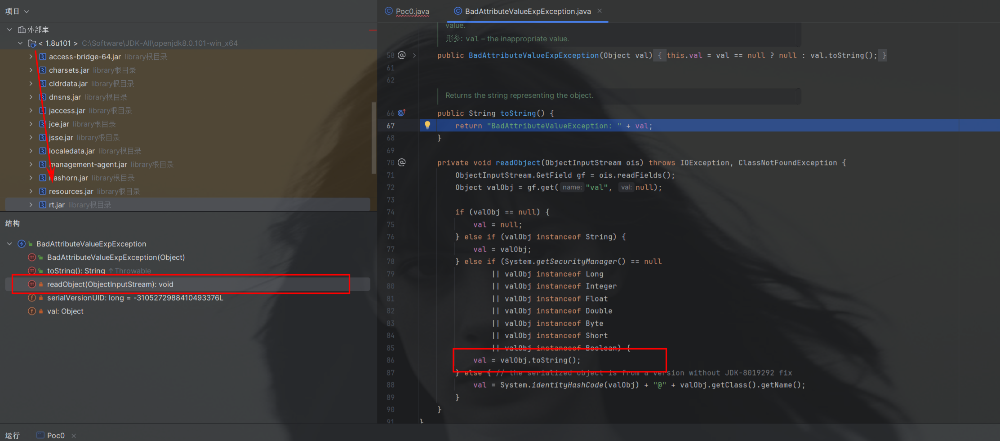

>  这两天好像出鬼了，对于Java我好像突然顿悟了。以前死看不懂的Java代码突然理解了。架构，模式在脑子里都更清晰了，看代码终于是有头绪了。（可能是最近给我的国外研究生学生上课，蹭了他们JavaSEC Spring的课件、加上又学了遍Java SE）


说起来，最近都在摸.net和Java，接触下来的感觉就是这两门语言的思想和语法都十分相似。

.net是为了理解内网的一些工具学的，Java则是大势所趋（Java这一套快赶上”苹果的生态“了）

学习Java反序列化，我的建议是也得先重点看看**Java的IO流**，这块是真的麻烦，在反序列化的理解中也挺重要。并且IO流这一块也是其他很多语言没有突出的地方，很多语言把IO流封装的很好，Java是把这块儿甩给开发者了。


> 谨以此文，记录我的Java学习历程

* CC1-7 链

我看过很多遍了，这两天才tm真懂了。后面准备多看看链子了。

[CC链 1-7 分析 - 先知社区 (aliyun.com)](https://xz.aliyun.com/t/9409#toc-0)


* 反序列化流程分析

我本身正是想跟一遍下面的内容，看看怎么从`inputStream.readObject();`到类里Override重写的`readObject()`的

```
ObjectInputStream inputStream = new ObjectInputStream(new FileInputStream("filename"));
inputStream.readObject();
```

正好碰见panda师傅文章了，写的简单详实

[序列化流程分析总结 - panda \| 热爱安全的理想少年](https://www.cnpanda.net/sec/893.html)

[反序列化流程分析总结 - panda \| 热爱安全的理想少年](https://www.cnpanda.net/sec/928.html)


* 动态代理

[Java进阶  Proxy动态代理机制详解 - 知了一笑 - 博客园 (cnblogs.com)](https://www.cnblogs.com/cicada-smile/p/14942945.html)

理解动态代理，先理解静态代理


* 二次反序列化

[二次反序列化 看我一命通关 - 跳跳糖 (tttang.com)](https://tttang.com/archive/1701/#toc_signedobject)


2023.10.25

-------------------------------------------------------------

# HashMap

java.util.HashMap，java原生类。经典的URLDNS链子

入口 readObject()

用于进入到任意类的hashCode()方法


# LazyMap

CC 依赖里的

入口get()方法

```
   //利用 get 方法可实现调用 ChainedTransformer#transform()
    public Object get(Object key) {
        if (!super.map.containsKey(key)) {
            //关键点
            Object value = this.factory.transform(key);
            super.map.put(key, value);
            return value;
        } else {
            return super.map.get(key);
        }
    }
```

CC 1-7里 几条链子的不同之处就是LazyMap的get()方法


# BadAttributeValueException

javax.management.BadAttributeValueException

入口 readObject()方法

用于触发任意类的 toString() 方法，通常是getter()方法的跳板



构造

````
BadAttributeValueExpException poc2 = new BadAttributeValueExpException(1);
Field val2 =
Class.forName("javax.management.BadAttributeValueExpException").getDeclaredField("val");
val2.setAccessible(true);
val2.set(poc2,json2);
````


# TemplatesImpl

经典的加载恶意字节码的链子，是几种链子的入口

入口一 newTransformer()
newTransformer() -
 getTransletInstance() -
  defineTransletClasses() - 
   loader.defineClass(_bytecodes[i])


入口二 getter()
getOutputProperties() - 
 newTransformer().getOutputProperties()


# URLDNS链子

也是串链，Hashmap类的入口配上URL类的触发

入口算是 hashCode()方法

```
HashMap.readObject() -
 HashMap.putVal()
  HashMap.hash() 
   key.hashCode()   //key可控，指定为为URL.hashCode()
    handler.hashCode(); //进入到URL类里
     HashCode()#getHostAddress()
```


[CC链 1-7 分析 - 先知社区 (aliyun.com)](https://xz.aliyun.com/t/9409#toc-1)

# CC1

```
	Gadget chain:
		ObjectInputStream.readObject()
			AnnotationInvocationHandler.readObject()
				Map(Proxy).entrySet()
					AnnotationInvocationHandler.invoke()
						LazyMap.get()
							ChainedTransformer.transform()
								ConstantTransformer.transform()
								InvokerTransformer.transform()
									Method.invoke()
										Class.getMethod()
								InvokerTransformer.transform()
									Method.invoke()
										Runtime.getRuntime()
								InvokerTransformer.transform()
									Method.invoke()
										Runtime.exec()
```


# CC2

```
	Gadget chain:
		ObjectInputStream.readObject()
			PriorityQueue.readObject()
				...
					TransformingComparator.compare()
						InvokerTransformer.transform()
							Method.invoke()
								Runtime.exec()
```


# CC3 


# # CC4


```
/*
 * Variation on CommonsCollections2 that uses InstantiateTransformer instead of
 * InvokerTransformer.
 */
```


# CC5

```
/*
    Gadget chain:
        ObjectInputStream.readObject()
            BadAttributeValueExpException.readObject()
                TiedMapEntry.toString()
                    LazyMap.get()
                        ChainedTransformer.transform()
                            ConstantTransformer.transform()
                            InvokerTransformer.transform()
                                Method.invoke()
                                    Class.getMethod()
                            InvokerTransformer.transform()
                                Method.invoke()
                                    Runtime.getRuntime()
                            InvokerTransformer.transform()
                                Method.invoke()
                                    Runtime.exec()

    Requires:
       commons-collections
 */
/*
This only works in JDK 8u76 and WITHOUT a security manager
```


# CC6

```
/*
    Gadget chain:
        java.io.ObjectInputStream.readObject()
            java.util.HashSet.readObject()
                java.util.HashMap.put()
                java.util.HashMap.hash()
                    org.apache.commons.collections.keyvalue.TiedMapEntry.hashCode()
                    org.apache.commons.collections.keyvalue.TiedMapEntry.getValue()
                        org.apache.commons.collections.map.LazyMap.get()
                            org.apache.commons.collections.functors.ChainedTransformer.transform()
                            org.apache.commons.collections.functors.InvokerTransformer.transform()
                            java.lang.reflect.Method.invoke()
                                java.lang.Runtime.exec()

    by @matthias_kaiser
*/
```


# CC7

```
/*
    Payload method chain:

    java.util.Hashtable.readObject
    java.util.Hashtable.reconstitutionPut
    org.apache.commons.collections.map.AbstractMapDecorator.equals
    java.util.AbstractMap.equals
    org.apache.commons.collections.map.LazyMap.get
    org.apache.commons.collections.functors.ChainedTransformer.transform
    org.apache.commons.collections.functors.InvokerTransformer.transform
    java.lang.reflect.Method.invoke
    sun.reflect.DelegatingMethodAccessorImpl.invoke
    sun.reflect.NativeMethodAccessorImpl.invoke
    sun.reflect.NativeMethodAccessorImpl.invoke0
    java.lang.Runtime.exec
*/
```


